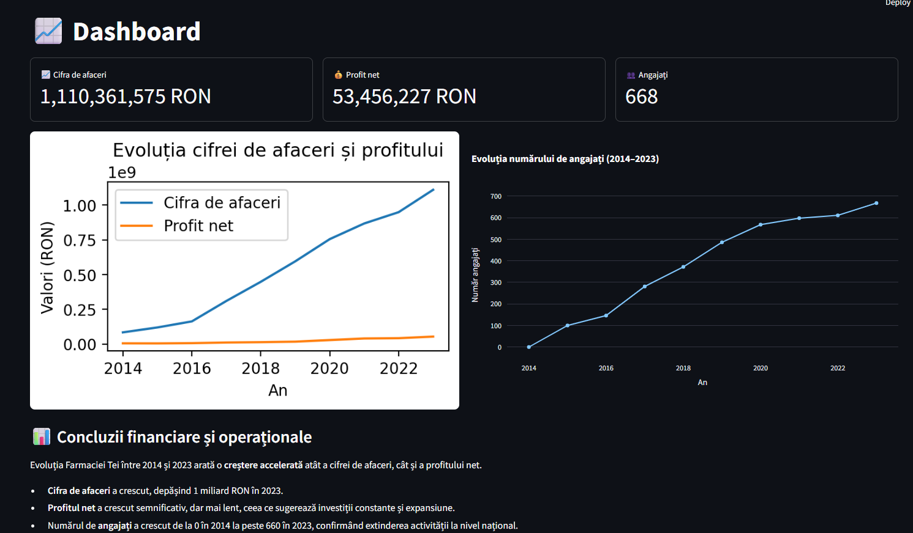
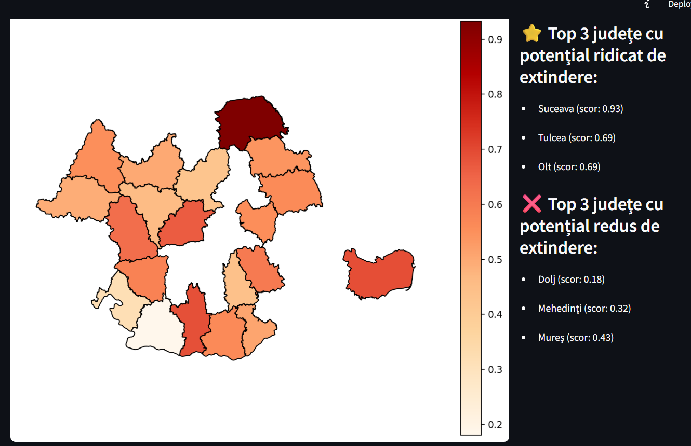
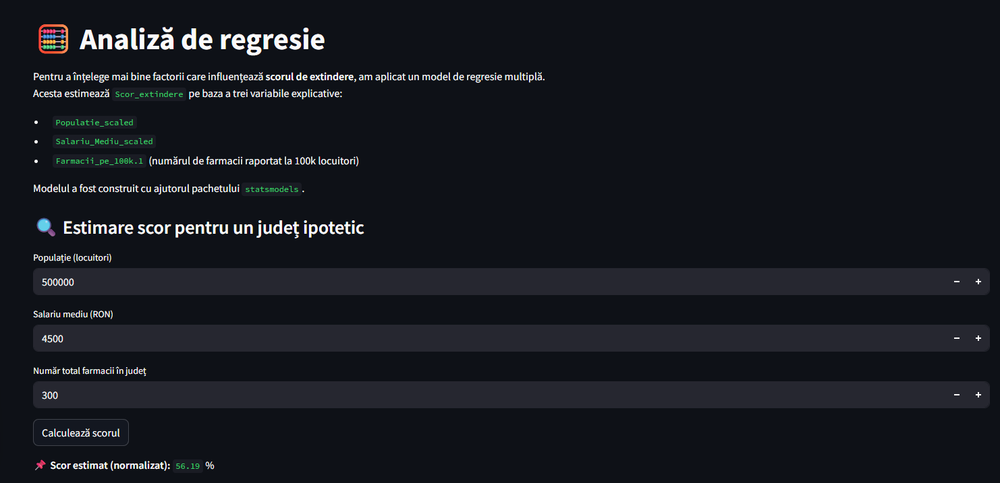
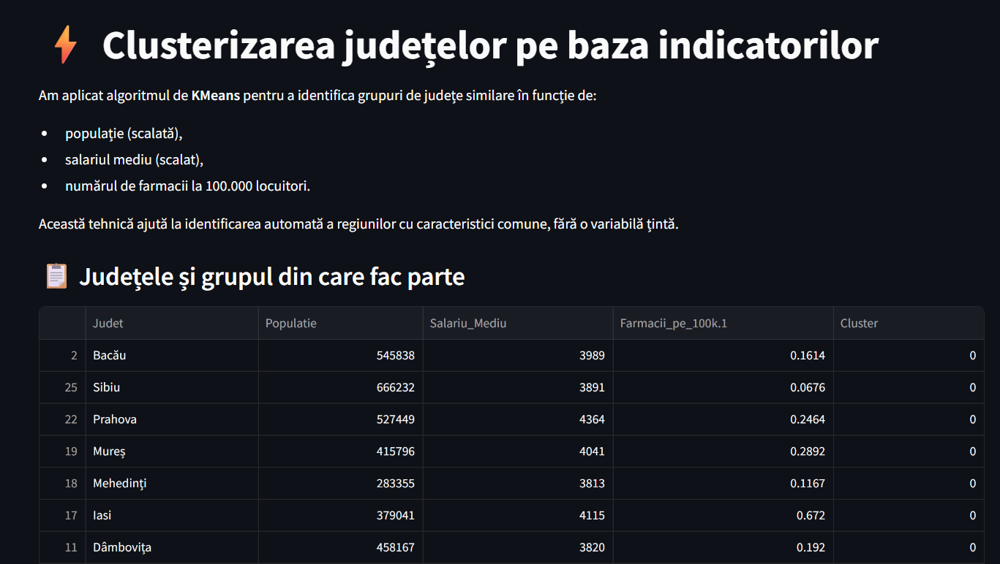
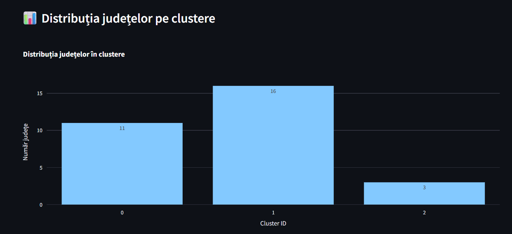
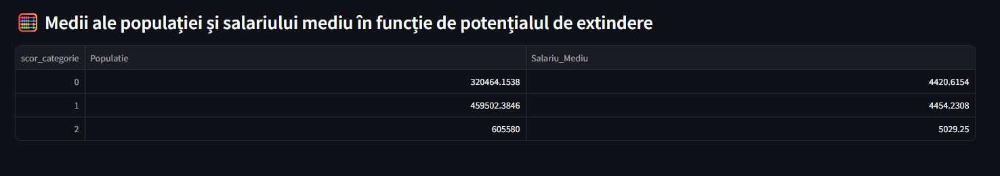
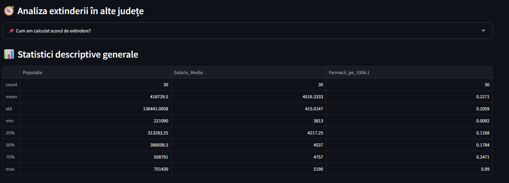

# 🧪 PharmacyExpansionAnalyzer-Streamlit

This is a Streamlit web application that analyzes the national expansion potential of Farmacia Tei, a major Romanian pharmacy chain. The project combines business data with geographic and demographic indicators to identify optimal counties for expansion.

## 🚀 Functionalities

- **Dashboard:** Displays key indicators (turnover, profit, employees) with charts showing their evolution (2014–2023).
- **Expansion Analysis:** Ranks Romanian counties based on population, income, and pharmacy density. Displays interactive maps and top/bottom 3 counties.
- **Regression Module:** Uses multiple linear regression to estimate the expansion score for hypothetical counties based on real indicators.
- **Clustering:** Applies KMeans to group counties with similar characteristics (population, income, pharmacy density).
- **County Comparison:** Allows side-by-side comparison between any two counties based on selected metrics.
- **Project Overview Page:** Brief presentation of the company, founders, and current locations.

## 🛠 Technologies Used

- Python (Pandas, Scikit-learn, Statsmodels, Plotly, Matplotlib, Geopandas)
- Streamlit
- Excel data source
- GeoJSON map for Romanian counties

## 📂 File Structure

- `Detalii.py` – project introduction page
- `1_Dashboard.py` – business evolution dashboard
- `2_Extindere.py` – expansion potential scoring and map
- `3_Regresie.py` – regression analysis module
- `4_Clusterizare.py` – KMeans clustering by indicators
- `5_Comparare.py` – compare two counties interactively

## 📌 Note

To run the app locally:
```bash
streamlit run Detalii.py
```

## 🖼️ Application Preview

### 📊 Dashboard – Business Indicators


### 🧑‍⚕️ Project Intro – About Farmacia Tei


### 📍 Map – County Expansion Potential


### 📈 Regression Estimator – Expansion Score


### 🔬 Clustering Counties by Features



### 📊 Distribution of Counties by Expansion Score


### 🧮 Averages by Expansion Potential


### 📋 Descriptive Stats for Expansion Metrics


### 🔄 County Comparison Module


